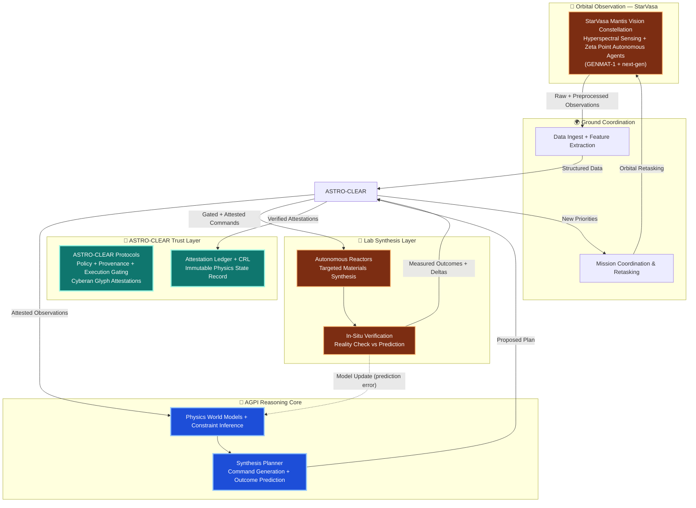

# PublicMissionDocs
A living repository of the StarVasa mission, as stated by the creator of it.

This diagram defines the canonical closed loop for StarVasa’s orbital AGPI architecture:
observe → attest(ASTRO-CLEAR) → reason(AGPI) → authorize → execute → verify → update.

ASTRO-CLEAR is not optional — it is the explicit gate between every physical and intelligent layer.
This is the living 1% that seeds the full ASTRO-CLEAR + co-evolved abundance flywheel.

